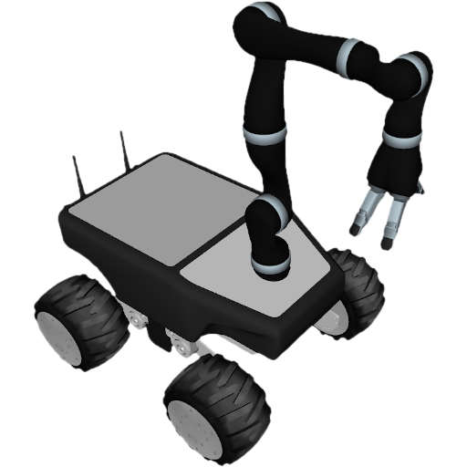

# lunalab_summit_xl_gen_description

URDF and SDF description of Summit XL-GEN (LunaLab variant).

<p align="center" float="middle">
  
</p>

## Instructions

### URDF

For URDF, [lunalab_summit_xl_gen.urdf.xacro](./urdf/lunalab_summit_xl_gen.urdf.xacro) is the primary descriptor that includes all other xacros and creates a model based on the passed arguments. To generate URDF out of xacro, you can use the included [xacro2urdf.bash](./scripts/xacro2urdf.bash) script and modify its arguments as needed. Once executed, [lunalab_summit_xl_gen.urdf](./urdf/lunalab_summit_xl_gen.urdf) will automatically be replaced. Alternatively, `xacro lunalab_summit_xl_gen.urdf.xacro name:="lunalab_summit_xl_gen" <arg_i>:=<val_i> ...` can be executed directly, e.g. this is preferred within any launch script.

In order to visualise URDF with RViz2, included [view.launch.py](./launch/view.launch.py) script can be used.

```bash
ros2 launch lunalab_summit_xl_gen_description view.launch.py
```

### SDF

For SDF, please use the included [xacro2sdf.bash](./scripts/xacro2sdf.bash) script with the desired arguments. This script makes sure that a correct relative path is used to locate all assets.

To visualise SDF with Gazebo, included [view_ign.launch.py](./launch/view_ign.launch.py) script can be used.

```bash
ros2 launch lunalab_summit_xl_gen_description view_ign.launch.py
```

## Disclaimer

Several of the included xacros and meshes originated in other repositories. Many of these descriptors and meshes were modified in order to represent the specific LunaLab variant and add support for Gazebo. Furthermore, additional improvements were added along the way, e.g. xacros were refactored, safety limits controllers were added, mesh geometry was remodelled to improve performance, materials of models were improved for `ogre2`, ...

## Directory Structure

The following directory structure is utilised for this package because it provides compatibility with Gazebo, including [Fuel](https://app.gazebosim.org).

```bash
.
├── config/initial_joint_positions.yaml      # List of initial joint positions for fake and simulated ROS 2 control
├── launch/                                  # [dir] ROS 2 launch scripts
    ├── view.launch.py                       # Launch script for visualising URDF with RViz2
    └── view_ign.launch.py                   # Launch script for visualising SDF with Gazebo
├── lunalab_summit_xl_gen/                   # [dir] Model directory compatible with Fuel
    ├── meshes/                              # [dir] Meshes for both URDF and SDF
        ├── **/collision/*.stl               # STL meshes for collision geometry
        └── **/visual/*.dae                  # COLLADA meshes for visuals
    ├── thumbnails/                          # [dir] Thumbnails for Fuel
    ├── model.config                         # Model meta data
    └── model.sdf                            # SDF (generated from URDF)
├── rviz/view.rviz                           # RViz2 config for visualising URDF
├── scripts/                                 # [dir] Additional useful scripts
├── urdf/                                    # [dir] URDF description (xacros)
    ├── manipulators/                        # [dir] Xacros for manipulators (e.g. Kinova j2s7s300)
    ├── misc/                                # [dir] Xacros for all miscellaneous additions to the platform
    ├── sensors/                             # [dir] Xacros for all sensors
    ├── summit_xl/                           # [dir] Xacros for Summit XL
    ├── lunalab_summit_xl_gen.gazebo         # Xacro for utilised Gazebo plugins
    ├── lunalab_summit_xl_gen.urdf           # URDF generated from `lunalab_summit_xl_gen.urdf.xacro`
    ├── lunalab_summit_xl_gen.urdf.xacro     # The primary xacro of the robot
    ├── lunalab_summit_xl_manipulators.xacro # Xacro for utilised manipulators
    ├── lunalab_summit_xl_misc.xacro         # Xacro for utilised miscellaneous additions
    └── lunalab_summit_xl_sensors.xacro      # Xacro for utilised sensors
├── CMakeLists.txt                           # Colcon-enabled CMake recipe
└── package.xml                              # ROS 2 package metadata
```
